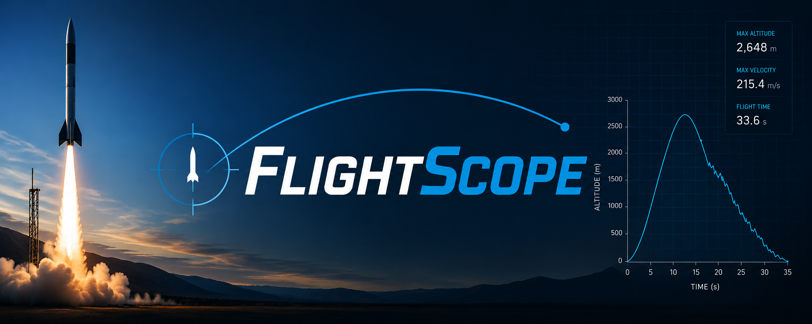

# FlightScope



FlightScope is a Python application designed to analyze and visualize model rocket flight data. It provides tools for importing flight logs, processing telemetry, detecting key flight events, and displaying flight performance through an interactive dashboard.

## Features

* Import and manage rocket flight data
* Interactive flight data visualization
* Automatic trimming of pre-launch idle data
* Automatic flight event detection

  * Launch
  * Apogee
  * Parachute Deploy
  * Landing
* Analysis of important flight metrics:

  * Maximum altitude
  * Maximum velocity
  * Maximum acceleration
  * Flight duration
* Local flight database management
* Streamlit-based user interface

## Installation

### Clone the repository

```bash
git clone https://github.com/yourusername/flightscope.git
cd flightscope
```

### Install dependencies

```bash
pip install -r requirements.txt
```

### Generate simulated flights

```bash
python test_data_writer.py
```

## Running FlightScope

Start the Streamlit application:

```bash
streamlit run dashboard.py
```

Then open the local URL shown in your terminal to access the dashboard.

## Project Structure

```text
FlightScope/
│
└─┬── pages                # Contains main app pages
  ├── Database_Manager.py  # Flight database management page
  ├── Flight_Comparison.py # Compare two flights using this page
┌─┴── Upload_Flight.py     # Page used for uploading flights into the database
│
└─┬── test_data            # (generated with `python test_data_writer.py`) Contains generated flights
  ├── flight_1.csv         # 
  ├── flight_2.csv         # 
┌─┴── flight_3.csv         # 
│
├── create_db.py         # Generates empty local database on app startup
├── Dashboard.py         # Main dashboard and flight visualization
├── data_import.py       # Data sanitizer for imported flights
├── db.py                # Creates local database on first startup
├── flights.db           # Local database
├── LICENSE.md           # 
├── mp4_tool.py          # Container for video-generation-related functions
├── README.md            # 
├── requirements.txt     # Python dependencies
├── rocket_render.txt    # Container for rocket-frame-rendering-related functions
└── test_data_writer.py  # Simulated flight generator
```

## Data Format

FlightScope supports CSV flight logs containing telemetry such as:

* Time (s)
* Altitude (m, ft)
* Velocity (m/s, ft/s)
* Acceleration (m/s^2, ft/s^2)
* Zenith (deg, rad, arcmin)
* Azimuth (deg, rad, arcmin)

The application automatically converts and cleans supported flight log formats before analysis.

## Future Plans

* Support for additional flight computer formats
* More advanced flight statistics and comparisons
* Improved flight event detection algorithms
* Flight profile simulations
* Exporting and sharing flight reports
* Unit support with unit detection from CSV flight files

## License

This project is currently licensed under the MIT License. See `LICENSE.md` for details.

---

Created by **Clifford St. Clair** as a personal aerospace engineering and software development project.
